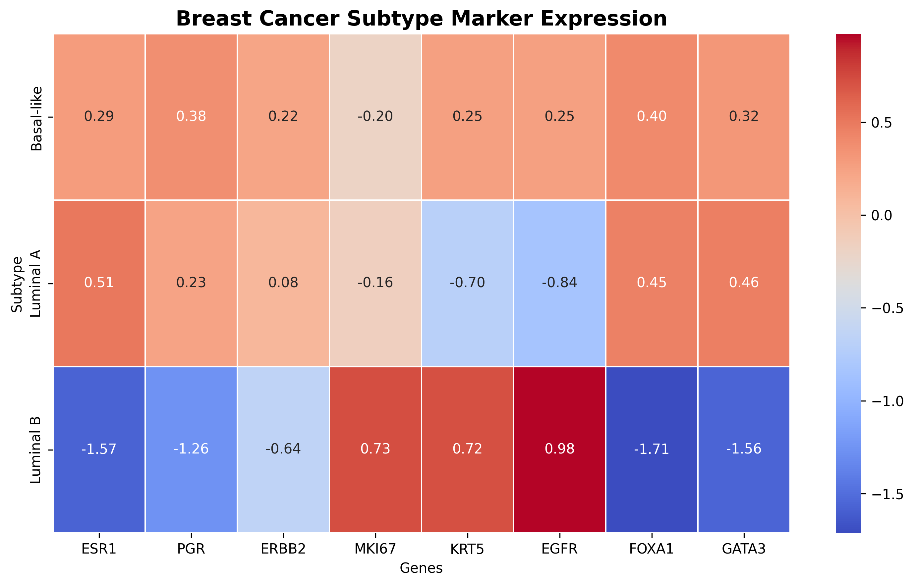
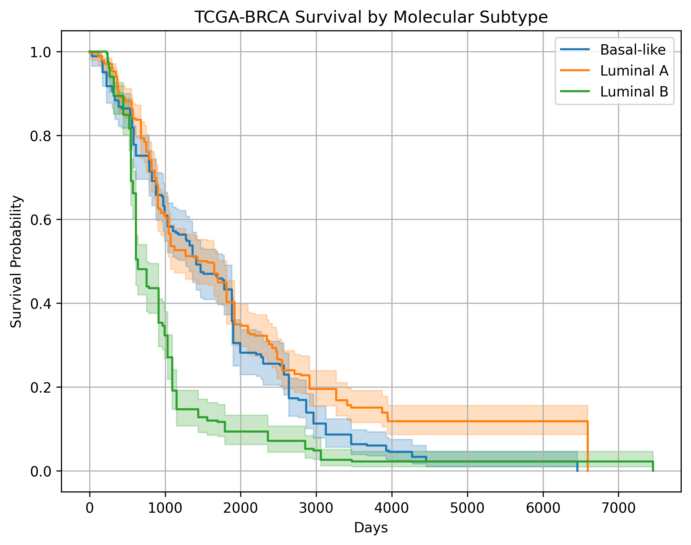
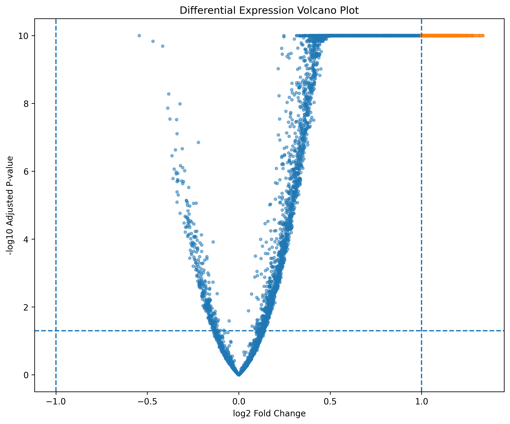
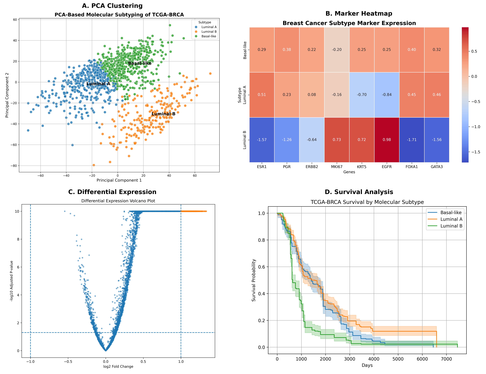

# TCGA-BRCA Breast Cancer Subtyping Using Transcriptomics

Computational identification of molecular breast cancer subtypes using TCGA RNA-seq data, survival analysis, differential expression analysis, and pathway enrichment.

---

# Overview

Breast cancer is a molecularly heterogeneous disease composed of biologically distinct subtypes with different clinical outcomes and therapeutic responses.

This project presents a transcriptomics-based computational framework for identifying molecular breast cancer subtypes using TCGA-BRCA RNA-seq data.

The analysis integrates:

- Gene expression profiling
- Unsupervised clustering
- Principal component analysis (PCA)
- Clinical survival analysis
- Differential expression analysis
- Pathway enrichment analysis
- Biological interpretation of subtype-specific signatures

The goal of this project is to identify biologically meaningful breast cancer subtypes and explore their translational and clinical relevance.

---

# Highlights

✔ ~1120 TCGA-BRCA samples analyzed  
✔ RNA-seq transcriptomic workflow  
✔ PCA + K-means subtype discovery  
✔ Kaplan-Meier survival analysis  
✔ Differential expression analysis  
✔ GO/KEGG pathway enrichment  
✔ Publication-style visualizations  
✔ Reproducible bioinformatics pipeline  

---

# Dataset

## Source

- TCGA-BRCA
- GDC Data Portal

## Data Types

- RNA-seq gene expression
- Clinical metadata

## Cohort Size

- ~1120 breast cancer samples

---

# RNA-seq Workflow

FASTQ → Quality Control → Alignment → Quantification → Normalization → PCA → Clustering → Subtyping → Survival Analysis → Differential Expression → Pathway Enrichment

## Conceptual Upstream RNA-seq Pipeline

```text
FASTQ (Raw Reads)
   ↓
Quality Control (FastQC)
   ↓
Read Trimming (fastp)
   ↓
Alignment (STAR / HISAT2)
   ↓
Post-alignment Processing (Samtools)
   ↓
Quantification (featureCounts / HTSeq)
   ↓
Gene Expression Matrix
   ↓
Normalization
   ↓
Downstream Analysis
(PCA → Clustering → Subtyping → Survival Analysis → DEG Analysis → Pathway Enrichment)
```

This project primarily focuses on downstream transcriptomic analysis using processed RNA-seq gene expression matrices.

---

# Methods

## 1. Data Preparation

- TCGA-BRCA RNA-seq expression matrices were merged
- Gene filtering and cleaning performed
- Clinical metadata integrated

## 2. Gene Expression Normalization

Expression values were normalized using z-score standardization to ensure comparability across samples.

## 3. Dimensionality Reduction

Principal Component Analysis (PCA) was performed to visualize transcriptomic variation and subtype separation.

## 4. Unsupervised Clustering

K-means clustering (k = 3) was applied to identify molecularly distinct breast cancer subtypes.

## 5. Subtype Annotation

Clusters were biologically interpreted using known breast cancer biomarkers including:

- ESR1
- PGR
- ERBB2
- EGFR
- KRT5
- FOXA1
- GATA3
- MKI67
- TP53

## 6. Survival Analysis

Kaplan-Meier survival analysis was performed to evaluate subtype-associated survival trends.

## 7. Differential Expression Analysis

Subtype-associated biomarkers were identified using differential gene expression analysis.

## 8. Pathway Enrichment Analysis

GO and KEGG enrichment analyses were performed to identify biologically enriched pathways among subtype-specific genes.

---

# Key Biological Findings

## Luminal Subtypes

Luminal tumors showed elevated expression of:

- ESR1
- PGR
- FOXA1
- GATA3

These tumors are associated with hormone receptor signaling and generally better prognosis.

## Basal-like Subtypes

Basal-like tumors exhibited:

- Increased EGFR expression
- Elevated KRT5 expression
- Strong proliferative signatures

These tumors are typically more aggressive and clinically challenging.

## Clinical Insights

- Distinct subtype-specific survival patterns were observed
- Transcriptomic profiles clearly separated tumor groups
- Pathway enrichment revealed hormone signaling and cell-cycle associated biology

---

# Results

## PCA Clustering

Shows transcriptomic separation of breast cancer subtypes after dimensionality reduction.


---

## Marker Gene Heatmap

Expression patterns of subtype-specific biomarkers across tumor clusters.



---

## Survival Analysis

Kaplan-Meier survival curves comparing subtype-associated clinical outcomes.



---

## Differential Expression Volcano Plot

Differentially expressed genes between breast cancer subtypes.



---

## Integrated Multi-panel Figure

Publication-style summary visualization integrating clustering, biomarkers, and survival analysis.



---

# Scientific Interpretation

The clustering results recapitulate biologically established breast cancer subtypes:

- Luminal tumors were enriched for hormone receptor signaling genes
- Basal-like tumors demonstrated proliferative and EGFR-associated signatures
- PCA revealed strong transcriptomic separation among subtypes
- Survival analysis suggested subtype-associated prognostic differences

These findings support the utility of transcriptomic profiling for molecular stratification of breast cancer.

---

# Repository Structure

```text
data/                → processed datasets
scripts/             → analysis scripts
results/             → generated plots and outputs
figures/             → publication-quality figures
README.md            → project documentation
requirements.txt     → dependencies
```

---

# Reproducibility

## Clone Repository

```bash
git clone https://github.com/sonia-genomics/cancer-subtyping-multiomics.git
cd cancer-subtyping-multiomics
```

## Install Dependencies

```bash
pip install -r requirements.txt
```

## Run Complete Pipeline

```bash
python scripts/01.generate_id_mapping.py
python scripts/02.merge_expression_data.py
python scripts/03.normalize_expression.py
python scripts/04.pca_cluster.py
python scripts/05.subtype_annotation.py
python scripts/06.extract_clinical.py
python scripts/07.prepare_survival_data.py
python scripts/08.kaplan_meier_analysis.py
python scripts/09.stage_distribution.py
python scripts/10.pca_visualization.py
python scripts/11.marker_heatmap.py
python scripts/12.differential_expression.py
python scripts/13.Volcano_plot.py
python scripts/14.pathway_enrichment.py
python scripts/15.multi_panel_figure.py
```

---

# Technologies Used

## Programming & Analysis

- Python
- Pandas
- NumPy
- SciPy
- Scikit-learn

## Visualization

- Matplotlib
- Seaborn

## Bioinformatics & Statistics

- Lifelines
- GSEApy

## Environment

- Linux
- TCGA/GDC datasets

---

# Future Directions

- Mutation integration
- Copy number variation analysis
- Multi-omics integration
- Drug response prediction
- Machine learning-based subtype classification
- Deep learning approaches for transcriptomic prediction
- Integration with proteomics and methylation datasets

---

# Research Significance

This project demonstrates a systems-level computational genomics workflow connecting:

Gene Expression → Computational Analysis → Biological Interpretation → Clinical Relevance

The framework highlights how transcriptomic data can be used for molecular stratification and biomarker discovery in cancer research.

---

# Author

**Sonia**  
MSc Biotechnology  
Bioinformatics & Genomics  

Aspiring researcher in:

- Cancer Genomics
- Transcriptomics
- Computational Biology
- Precision Medicine